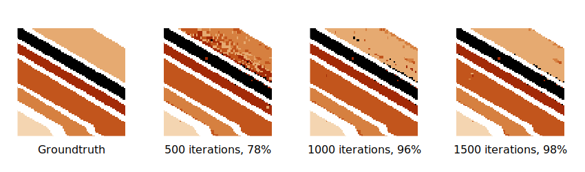
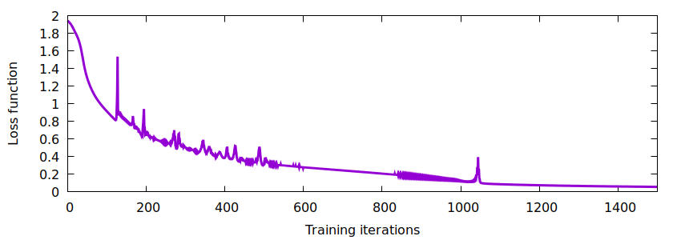

# Convolutional neural network for hyperspectral images classification

## Synopsis

This is a simple deep convolutional neural network for hyperspectral images
classification. Main aim was to understand how such networks are implemented,
so no third-party DNN libraries were used.

The network consists of 4 layers [1]:

* Convolutional layer (`tanh`, ~10 filters, kernel size ~20)
* Pooling layer (`max`, pooling size ~5)
* Fully connected layer (`tanh`, ~100 nodes)
* Output layer (`softmax`, ~10 nodes)

The total number of trainable parameters is ~35,000.

The standard thread support library is used to parallelize the code.

## Results

Hyperspectral data from [2] was used to test the network. The image below shows
the classification result after the specified number of training steps.



([Large image](example/salinas/salinas.png)



## How to build

Set `MKLROOT` environment variable to point to the MKL installation directory,
and be sure that your CMake version is >= 3.13. Then:

```sh
git clone --recursive https://github.com/eugnsp/cnn_hsi.git
cd cnn_hsi
mkdir build && cd build
cmake -DCMAKE_BUILD_TYPE=RELEASE .. && make
```

C++17 compiler is required. Tested with GCC 8.3.0.

## How to run

[to be written]

## To do

[to be written]

## External dependencies

* [Intel MKL](https://software.intel.com/en-us/mkl)
* [`es_la` library](https://github.com/eugnsp/es_la)
* [`es_util` library](https://github.com/eugnsp/es_util)

## References

1. Wei Hu et al. *Deep convolutional neural networks for hyperspectral image
classification*.\
[J. Sensors **2015**, article ID 258619 (2015)](https://doi.org/10.1155/2015/258619),
2. [Hyperspectral remote sensing scenes](http://www.ehu.eus/ccwintco/index.php?title=Hyperspectral_Remote_Sensing_Scenes).

## License

This code is distributed under GNU General Public License v3.0.
